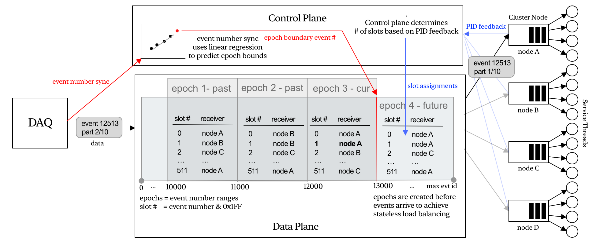

# Introduction

`udplbd` is the control plane for the **EJFAT** (ESnet–Jefferson Lab FPGA-Accelerated Transport) project. It manages UDP-based load balancers that route high-throughput event data to a dynamic pool of worker nodes, with the forwarding table implemented in a P4 program (`udplb`) running on an ESnet SmartNIC FPGA.

This guide is for **system administrators** who deploy, configure, and operate udplbd. It covers installation, runtime configuration, user and token management, observability, database maintenance, and troubleshooting. Workflow developers who use the gRPC API to reserve load balancers should refer to the API documentation produced by `cargo doc`.

## High Level Overview

## Further reading

- **API reference:** `cargo doc --open` — generated from Rust doc comments and proto definitions
- **Installation instructions:** [Installation](installation.md)
- **Configuration reference:** [Configuration](configuration.md)
- **Protocol buffer definitions:** [`proto/loadbalancer/loadbalancer.proto`](https://github.com/esnet/udplbd2/blob/main/proto/loadbalancer/loadbalancer.proto)
- **P4 dataplane:** [ESnet SmartNIC project](https://github.com/esnet/esnet-smartnic-fw)
