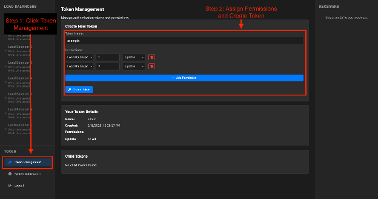

# User Management

udplbd uses a **token-based permission system** for all gRPC and REST API access. There are no user accounts or passwords — every operation is authenticated by a Bearer token, and every token carries an explicit set of permissions.

## Token model

### The root admin token

The root token is the value of `server.auth_token` in `config.yml`. It is created when you write the configuration file and has implicit **UPDATE ALL** permission — full administrative access to every resource. There is only one root token and it cannot be revoked through the API (changing it requires editing the config file and restarting the daemon).

Treat the root token as you would a root password: store it in a secrets manager, avoid putting it in shell history, and do not share it with workflow users. Instead, use it to mint narrower child tokens for teams.

### Token hierarchy

Tokens form a tree. When a token creates a child token, the child can only be granted permissions the parent already holds — you cannot escalate privilege. Revoking a parent token cascades to all of its descendants.

### Permissions

Each permission has two dimensions: a **resource type** and a **permission level**.

**Resource types:**

| Resource type   | Description                                                             |
| --------------- | ----------------------------------------------------------------------- |
| `ALL`           | All resources (global admin scope)                                      |
| `LOAD_BALANCER` | A specific FPGA load balancer instance (requires a resource ID)         |
| `RESERVATION`   | A specific reservation on a load balancer (requires a resource ID)      |
| `SESSION`       | A specific worker session within a reservation (requires a resource ID) |

Resource types form a hierarchy: `ALL` implies permission on everything beneath it. `LOAD_BALANCER` implies permission on its reservations and their sessions.

**Permission levels (least to most privileged):**

| Level     | CLI name   | What it allows                                                            |
| --------- | ---------- | ------------------------------------------------------------------------- |
| Read-only | `READ`     | View state: `overview`, `version`, `list-permissions`, `list-children`    |
| Register  | `REGISTER` | Register/deregister as a worker session within an existing reservation    |
| Reserve   | `RESERVE`  | Create and free reservations on a load balancer                           |
| Update    | `UPDATE`   | Full control: create tokens, revoke tokens, manage senders, reset, extend |

Higher levels imply lower ones: `UPDATE` implies `RESERVE`, which implies `REGISTER`, which implies `READ`.

## Recommended workflow

The typical setup is:

1. The **admin** holds the root token (or a token with `UPDATE ALL`).
2. The admin mints one **team token** per experiment team, granting `UPDATE LOAD_BALANCER:<id>` for the relevant FPGA LB instance.
3. Each **team** uses their token to self-manage: reserving LBs, adding senders, registering workers, and creating further child tokens as needed for their workflow components.

### Step 1: Identify the load balancer ID

```sh
export EJFAT_URI="ejfat://ADMIN_TOKEN@udplbd.example.net:19523"
udplbd client overview
```

Example output:
```
LB 1 - "alpha-run"
  sync: 198.51.100.1:19531
  ipv4: 198.51.100.1
  ...
```

The LB ID here is `1`.

### Step 2: Mint a team token

#### Web UI

Go to `https://<server.listen>` and paste in your admin token when prompted. Then navigate to Token Management in the bottom left corner.



#### CLI
```sh
udplbd client tokens create "team-alpha" \
  --resource-type LOAD_BALANCER \
  --resource-id 1 \
  --permission UPDATE
```

Output:
```
Created token: a1b2c3d4e5f6...
export 'EJFAT_URI=ejfat://a1b2c3d4e5f6...@udplbd.example.net:19523/lb/1'
```

Give the team the printed `EJFAT_URI`. They set it in their environment and can now fully manage that load balancer without ever seeing the root token.

### Step 3: Team self-manages

With `EJFAT_URI` set to their token's URI:

```sh
# reserve a load balancer for 2 hours
udplbd client reserve "my-experiment" \
  --sender 10.0.1.5 \
  --after 2h

# add an additional allowed sender
udplbd client senders add 10.0.1.6

# extend the reservation if the run goes long
udplbd client extend --after 1h

# check status
udplbd client overview

# free when done
udplbd client free
```

The team can also create further child tokens — for example a `RESERVE`-only token for an automated scheduler that should not be able to manage other tokens:

```sh
udplbd client tokens create "team-alpha-scheduler" \
  --resource-type LOAD_BALANCER \
  --resource-id 1 \
  --permission RESERVE
```

## Token management commands

All commands below use the token embedded in `EJFAT_URI` (or `--url`) as the acting token.

### Create a token

```sh
udplbd client tokens create NAME \
  --resource-type ALL|LOAD_BALANCER|RESERVATION|SESSION \
  [--resource-id ID] \
  --permission READ|REGISTER|RESERVE|UPDATE
```

`--resource-id` is required for `LOAD_BALANCER`, `RESERVATION`, and `SESSION` resource types. For `ALL`, omit it.

Prints the new token value and a ready-to-use `EJFAT_URI`.

### Inspect a token's permissions

```sh
# permissions of the current token (from EJFAT_URI)
udplbd client tokens list-permissions

# permissions of a specific token (admin only)
udplbd client tokens list-permissions OTHER_TOKEN
```

### List child tokens

```sh
udplbd client tokens list-children
```

Lists all tokens descended from the current token, including their names, IDs, and permissions.

### Revoke a token

```sh
udplbd client tokens revoke TOKEN_VALUE
```

Revocation cascades: all tokens descended from the revoked token are also invalidated immediately. A token can revoke any of its own descendants, or any token at all if it holds `UPDATE ALL`.

## Security considerations

- **Never use the default `auth_token`** (`udplbd2changeme`). Generate a random value, for example with `openssl rand -hex 32`.
- **Prefer narrow permissions.** Grant `RESERVE` to workflow automation; reserve `UPDATE` for humans who need to manage tokens or reset load balancers.
- **Rotate tokens by revoking and re-issuing.** No daemon restart is required — revocation takes effect immediately.
- **Scope to specific LB IDs** rather than `ALL` wherever possible. This limits the blast radius if a token is leaked.
- **Protect the root token.** If it is compromised, the only remedy is to update `server.auth_token` in the config file and restart the daemon.